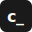

<div align="center">



# Claude Code Cheat Sheet

**The complete Claude Code cheat sheet — commands, shortcuts, features & tips in one place.**

[Live Site](https://clawd.patriciomarroquin.dev) &bull; [Report Issue](https://github.com/patricio0312rev/claude-sheet/issues) &bull; [Contribute](#contributing)

</div>

---

## What's Inside

Every section Claude Code users reach for daily:

- **Keyboard Shortcuts** — navigation, editing, session control
- **Slash Commands** — session, config, and development commands
- **CLI Launch Flags** — startup options and overrides
- **The Big 5** — CLAUDE.md, commands, hooks, MCP, and memory
- **Permission Modes** — trust levels and how they work
- **Hooks & Event Automation** — pre/post tool execution hooks
- **Input Superpowers** — piping, images, URLs, and multi-turn tricks
- **Configuration** — settings priority, config CLI, permissions
- **File Structure Map** — where Claude Code keeps its files
- **Rewind & Checkpoints** — undo changes and restore state
- **Pro Workflow Tips** — patterns for getting the best results
- **Custom Commands** — project and user-level command templates
- **Remote Sessions** — SSH, headless, and CI/CD usage
- **Quick Reference** — the most-used combos at a glance

## Tech Stack

| Layer | Tool |
|-------|------|
| Framework | [Astro 5](https://astro.build) |
| UI | [React 19](https://react.dev) (islands) |
| Styling | [Tailwind CSS 4](https://tailwindcss.com) |
| Icons | [Lucide React](https://lucide.dev) |
| Fonts | Plus Jakarta Sans, DM Sans, IBM Plex Mono |
| Package Manager | pnpm |

## Getting Started

```bash
# clone
git clone https://github.com/patricio0312rev/claude-sheet.git
cd claude-sheet

# install
pnpm install

# dev server at localhost:4321
pnpm dev

# production build
pnpm build

# preview production build
pnpm preview
```

## Project Structure

```
src/
├── components/        # React island components
│   ├── ClaudeIcon     # Claude AI logo SVG
│   ├── CopyButton     # Code block copy button
│   ├── CopyCommands   # Row-level & code-level click-to-copy
│   ├── HeadingIcons   # Section icons injected into H2s
│   ├── KeyboardNav    # Keyboard navigation hint
│   ├── MobileToc      # Mobile table of contents overlay
│   ├── ScrollSpy      # Active TOC link tracking
│   ├── SearchModal    # Spotlight-style search (/ key)
│   ├── StickyHeader   # Fixed header on scroll
│   ├── ThemeToggle    # Light/dark mode switch
│   └── Toast          # Cross-island toast notifications
├── content/sheet/     # Cheat sheet markdown content
├── layouts/           # Astro layout (head, meta, SEO)
├── pages/             # Single index page
├── styles/            # Global CSS and design tokens
└── utils/             # Shared helpers (icons, DOM)
```

## Features

- **Dark mode** — detects system preference, manual toggle, no FOUC
- **Spotlight search** — press `/` to filter all sections with live preview
- **Click-to-copy** — table rows, inline code elements, and code blocks
- **Sticky header** — frosted glass bar with search, theme toggle, scroll-to-top
- **Keyboard navigation** — `j`/`k` to jump between sections
- **Responsive** — sidebar TOC on desktop, bottom sheet on mobile
- **SEO** — Open Graph, Twitter cards, auto-generated sitemap, robots.txt
- **Accessible** — skip-to-content, focus-visible outlines, semantic HTML

## Design

Brutalist-inspired with warm tones. No border-radius, offset shadows, square strokes, textured grain overlay. Light mode defaults to warm cream (`#FAFAF7`), dark mode to deep warm black (`#141310`). Typography pairs Plus Jakarta Sans (headings) with DM Sans (body) and IBM Plex Mono (code).

## Contributing

1. Fork the repo
2. Create a branch (`feat/your-feature`)
3. Make your changes
4. Open a PR against `main`

Content lives in `src/content/sheet/cheat-sheet.md` — if Claude Code ships a new feature, add it there.

## License

MIT

---

<div align="center">

Made with 💜 by [@patricio0312rev](https://github.com/patricio0312rev)

</div>
